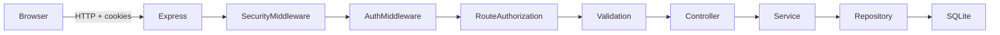
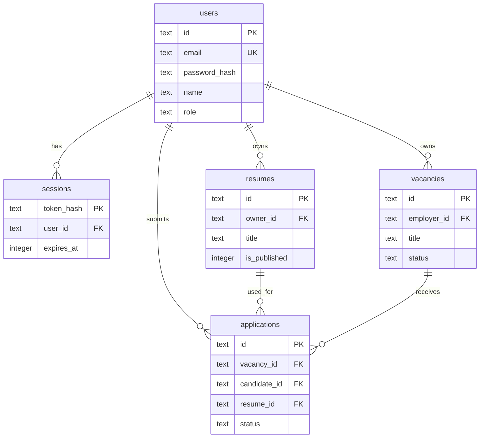
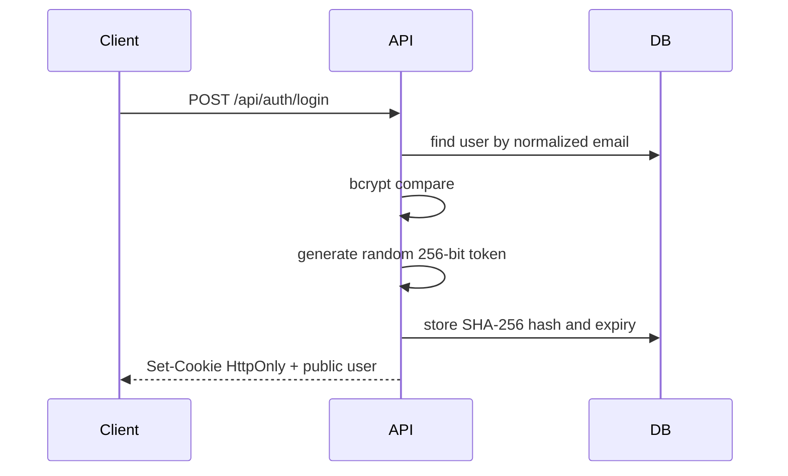

# Architecture

## Назначение

Backend предоставляет стабильный локальный API для будущих frontend-заданий:

- cookie-based authentication;
- server-side authorization;
- CRUD связанных сущностей;
- роли и ownership;
- реальные HTTP-статусы и ошибки.

## Поток запроса

### Ответственность слоёв

- `routes`: URL, method, последовательность middleware.
- `controllers`: перевод HTTP request в вызовы приложения и формирование response.
- `services`: auth, user lifecycle и permission/business rules.
- `repositories`: параметризованный SQL.
- `schemas`: входная валидация Zod.
- `middleware`: auth, roles, ошибки, CORS, rate limiting.
- `db`: соединение, миграции и seed.

Reducer/React Context на frontend не являются частью backend security.

## Модель данных

Skills хранятся как JSON-массив внутри SQLite TEXT. На границе API они всегда представлены массивом.

## Session authentication

### Login

В cookie находится случайный raw token. В БД находится только его SHA-256 hash. Утечка таблицы sessions не даёт готовые значения cookie.

При каждом запросе:

1. cookie извлекается через `cookie-parser`;
2. token хэшируется;
3. session ищется в SQLite;
4. проверяется `expires_at`;
5. актуальный пользователь загружается из `users`;
6. middleware записывает public user в `req.auth`.

Logout удаляет server-side session. Простого удаления cookie недостаточно.

## Роли

### CANDIDATE

- CRUD собственных resumes;
- чтение опубликованных vacancies;
- создание application только со своим resume;
- просмотр и отзыв собственных applications.

### EMPLOYER

- чтение опубликованных resumes;
- CRUD собственных vacancies;
- просмотр applications только для собственных vacancies;
- изменение application status.

### ADMIN

- управление всеми resumes и vacancies;
- просмотр и удаление applications;
- полный CRUD users и изменение roles;
- не создаёт role-owned resume/vacancy от своего имени.

Проверка роли не заменяет ownership. EMPLOYER не получает доступ к vacancy другого EMPLOYER.
Смена роли запрещена, пока у пользователя есть role-specific данные. Последнего ADMIN нельзя удалить или понизить.

## Security baseline

Реализовано:

- HttpOnly cookie;
- `SameSite=Lax`;
- `Secure` в production;
- allowlisted CORS origin и `credentials`;
- Helmet;
- общий и auth-specific rate limiting;
- bcrypt password hashing с входным лимитом 72 UTF-8 байта;
- каждый login создаёт отдельную session; предыдущие sessions сохраняются;
- истечение и удаление sessions;
- Zod allowlist validation;
- parameterized SQL;
- JSON body size limit;
- проверка trusted `Origin` для authenticated unsafe requests;
- loopback bind `127.0.0.1` по умолчанию;
- SHA-256 checksums применённых migrations;
- единый error handler без password/hash/token;
- публичная регистрация не может создать ADMIN.

## CSRF и CORS

Локальный frontend и API имеют разные origins, поэтому:

- server разрешает только `CLIENT_ORIGIN`;
- browser request должен использовать `credentials: 'include'`;
- JSON POST/PATCH вызывает CORS preflight;
- `SameSite=Lax` ограничивает cross-site cookie sending.
- authenticated unsafe request с присутствующим `Origin` принимается только от `CLIENT_ORIGIN`;
- logout и withdraw требуют `application/json`, поэтому не отправляются простой HTML-формой.

Это базовая учебная защита. CORS не является полноценной CSRF-защитой, а `SameSite` не закрывает все deployment-сценарии. Production-приложение должно спроектировать CSRF-token/origin checks с учётом своей топологии.

## Почему не JWT

Для этого учебного backend выбраны opaque server-side sessions:

- logout и role changes немедленно отзывают sessions;
- в браузере нет JWT payload;
- student видит автоматическую отправку HttpOnly-cookie;
- не требуется refresh-token flow до изучения основ.

JWT может быть оправдан в другой архитектуре, но не является автоматически более безопасным.

## Почему не ORM

Параметризованный SQL оставлен видимым:

- проще проследить ownership query;
- миграции не зависят от генерации клиента;
- меньше скрытой магии для учебного backend;
- SQLite-файл легко удалить и пересоздать.

Любой пользовательский ввод передаётся параметром. Динамические имена колонок выбираются только из серверной allowlist.
